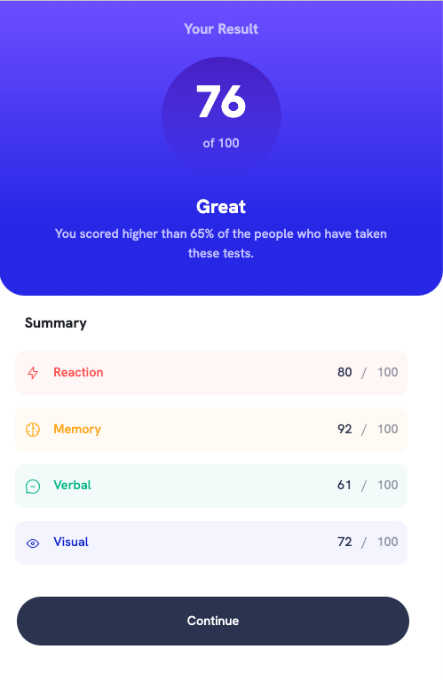
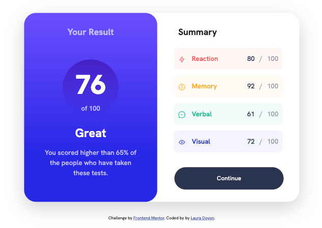

# Frontend Mentor - Results summary component solution

This is a solution to the [Results summary component challenge on Frontend Mentor](https://www.frontendmentor.io/challenges/results-summary-component-CE_K6s0maV). Frontend Mentor challenges help you improve your coding skills by building realistic projects.

## Table of contents

- [Overview](#overview)
  - [The challenge](#the-challenge)
  - [Screenshot](#screenshot)
  - [Links](#links)
- [My process](#my-process)
  - [Built with](#built-with)
  - [What I learned](#what-i-learned)
  - [Continued development](#continued-development)
  - [Useful resources](#useful-resources)
- [Author](#author)

**Note: Delete this note and update the table of contents based on what sections you keep.**

## Overview

### The challenge

Users should be able to:

- View the optimal layout for the interface depending on their device's screen size
- See hover and focus states for all interactive elements on the page

### Screenshot

Mobile-view:


Desktop-view:


### Links

- Solution URL: [Frontend Mentor](https://www.frontendmentor.io/solutions/results-summary-component-G2cNvP1hP1)
- Live Site URL: [Results Summary Component](https://tubular-syrniki-8a0018.netlify.app/)

## My process

### Built with

- Semantic HTML5 markup
- CSS custom properties
- Responsive layout
- Flexbox
- Bootstrap
- Mobile-first workflow

### What I learned

Firstly, I learned how to create a linear gradient background. It was interesting exploring different color combinations and effects using this technique.

```css
background-color: var(--main-bg-light);
background: linear-gradient(
  0deg,
  var(--main-bg-light) 25%,
  var(--main-bg-dark) 100%
);
```

Furthermore, I used this project as an opportunity to reinforce my understanding and usage of the nth-child() selector. This selector allowed me to target a specific child element within a parent container.

```css
p:nth-child(2),
p:nth-child(4),
h3.result {
  color: hsl(241, 100%, 89%);
}
```

Overall, this project was a great learning experience and helped me solidify my knowledge in these areas.

### Continued development

I will be continuing to focus on implementing a mobile-first workflow. This approach is relatively new to me, but I am dedicated to improving and refining my skills in this area.

### Useful resources

https://developer.mozilla.org/en-US/docs/Web/CSS/:first-child
https://cssgradient.io/

- [:nth-child](https://developer.mozilla.org/en-US/docs/Web/CSS/:nth-child) - This resource was used as a guide for implementing the nth-child selector. I did reference the :first-child selector on mdn web docs, but ultimately chose to implement the nth-child selector.
- [CSS gradient](https://cssgradient.io/) - This helped me visually understand how to create a gradient background. I'd recommend it to anyone still learning this concept that needs a visual to play with before implementing your project.

## Author

- Website - [Laura Doyon](https://lauradoyon.netlify.app/)
- Frontend Mentor - [@L-itslocked](https://www.frontendmentor.io/profile//L-itslocked)
- CodePen - [@Itslocked]
- LinkedIn - [@doyonlaura](https://www.linkedin.com/in/doyonlaura)
